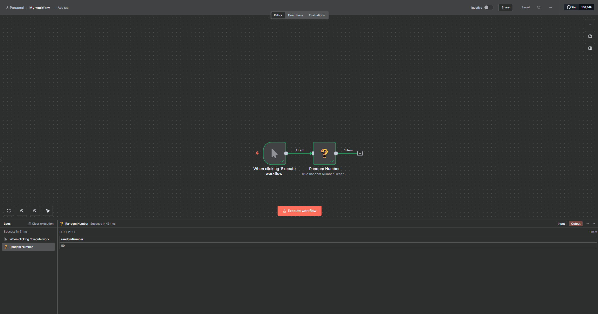

# 🔗 Conector n8n Customizado: Gerador de Números Aleatórios (Random.org)

Este repositório contém a implementação de um **conector customizado** para a plataforma **n8n**, desenvolvido como parte de um desafio técnico.

- ⚙️ **Infraestrutura:** Instância local do n8n com banco de dados PostgreSQL, gerenciada via Docker Compose.  
- 🎲 **Conector Customizado:** Um nó chamado `Gerador de Número Aleatório`, que consome a API do [Random.org](http://random.org) para gerar números inteiros verdadeiramente aleatórios.

O guia abaixo descreve todo o processo de configuração e execução do conector.

---

## 📑 Sumário
- [🚀 Pré-requisitos](#-pré-requisitos)  
- [📂 Estrutura de Pastas](#-estrutura-de-pastas)
- [🔧 Instalação das Dependências](#-instalação-das-dependências)
- [⚙️ Configuração do Ambiente](#️-configuração-do-ambiente)
- [⚡ Passo 1: Subir a Infraestrutura](#-passo-1-subir-a-infraestrutura)  
- [🛠️ Passo 2: Instalar e Linkar o Nó Customizado](#️-passo-2-instalar-e-linkar-o-nó-customizado)  
  - [2.1 - Compilar o Código](#21---compilar-o-código)  
  - [2.2 - Copiar os Arquivos Manualmente](#22---copiar-os-arquivos-manualmente)  
  - [2.3 - Reiniciar o n8n](#23---reiniciar-o-n8n)  
- [✅ Passo 3: Validar na Interface do n8n](#-passo-3-validar-na-interface-do-n8n)
- [🧪 Executar Testes](#-executar-testes)
- [🐞 Troubleshooting (Solução de Problemas)](#-troubleshooting-solução-de-problemas)  
- [📌 Apêndice: Comandos Úteis](#-apêndice-comandos-úteis)  

---

## 🚀 Pré-requisitos
- [Docker](https://www.docker.com/get-started/) e **Docker Compose** instalados.  
- [Node.js](https://nodejs.org/) v20 (LTS) ou superior, junto com **npm**.  
- Porta `5678` livre na máquina local.  

---

## 📂 Estrutura de Pastas
A estrutura final do projeto está organizada da seguinte forma:

```
.
├── .gitignore                      # Ignora arquivos desnecessários (ex: node_modules)
├── docker-compose.yml              # Configuração do n8n + PostgreSQL
├── n8n-nodes-random/               # Código-fonte do conector customizado
│   ├── nodes/
│   │   └── Random/
│   │       ├── icon.svg
│   │       └── Random.node.ts
│   ├── package.json
│   └── ... (arquivos de configuração do projeto Node.js)
└── README.md                       # Este guia
```

---

## 🔧 Instalação das Dependências

### Dependências do Sistema
Certifique-se de ter instalado:
- **Docker** versão 20.10 ou superior
- **Docker Compose** versão 2.0 ou superior  
- **Node.js** versão 20 (LTS) ou superior
- **npm** versão 10 ou superior

### Dependências do Projeto
```bash
# Clone o repositório (se ainda não o fez)
git clone <url-do-repositorio>
cd meu_projeto_n8n

# Instale as dependências do conector customizado
cd n8n-nodes-random
npm install
cd ..
```

---

## ⚙️ Configuração do Ambiente

### Variáveis de Ambiente
O projeto usa as seguintes variáveis de ambiente no `docker-compose.yml`:

#### **PostgreSQL:**
- `POSTGRES_USER=n8n` - Usuário do banco de dados
- `POSTGRES_PASSWORD=mysecretpassword` - Senha do banco de dados  
- `POSTGRES_DB=n8n` - Nome do banco de dados

#### **n8n:**
- `DB_TYPE=postgresdb` - Tipo do banco de dados
- `DB_POSTGRESDB_HOST=postgres` - Host do PostgreSQL
- `DB_POSTGRESDB_PORT=5432` - Porta do PostgreSQL
- `DB_POSTGRESDB_DATABASE=n8n` - Nome do banco
- `DB_POSTGRESDB_USER=n8n` - Usuário do banco
- `DB_POSTGRESDB_PASSWORD=mysecretpassword` - Senha do banco
- `N8N_DEV_MODE=true` - Modo de desenvolvimento habilitado

### Configuração do Banco de Dados
O PostgreSQL é configurado automaticamente via Docker Compose com:
- **Porta:** 5432 (interna do container)
- **Banco:** n8n
- **Usuário:** n8n  
- **Senha:** mysecretpassword
- **Volume persistente:** `postgres_data`

### Portas Utilizadas
- **5678** - Interface web do n8n (http://localhost:5678)
- **5432** - PostgreSQL (apenas interno aos containers)

---

## ⚡ Passo 1: Subir a Infraestrutura
O `docker-compose.yml` inicia dois contêineres: **n8n** e **PostgreSQL**.

1. Abra um terminal na raiz do projeto.  
2. Suba os serviços em segundo plano:  
   ```bash
   docker compose up -d
   ```

3. Aguarde cerca de 1 minuto até que os serviços estejam disponíveis:

🌐 Interface do n8n → http://localhost:5678

ℹ️ **Nota:** As credenciais do banco de dados estão definidas diretamente no `docker-compose.yml` para simplificar. Não é necessário criar um `.env`.

## 🛠️ Passo 2: Instalar e Linkar o Nó Customizado
Para que o n8n reconheça o conector, é necessário compilá-lo e copiá-lo para o diretório monitorado pelo n8n.

⚠️ **Importante:** O método `npm link` pode apresentar problemas no Windows. O processo manual descrito abaixo é a forma mais estável de configurar.

### 2.1 - Compilar o Código
```bash
# 1. Entre na pasta do conector
cd n8n-nodes-random

# 2. Instale as dependências
npm install

# 3. Compile o código (gera a pasta "dist")
npm run build
```
### 2.2 - Copiar os Arquivos Manualmente
No Windows, execute no PowerShell:

```powershell
# 1. Volte para a raiz do projeto
cd ..

# 2. Crie a pasta de destino dentro do diretório .n8n
mkdir C:\Users\$env:USERNAME\.n8n\custom\n8n-nodes-random

# 3. Copie o package.json
copy n8n-nodes-random\package.json C:\Users\$env:USERNAME\.n8n\custom\n8n-nodes-random\

# 4. Copie a pasta "dist" inteira
xcopy n8n-nodes-random\dist C:\Users\$env:USERNAME\.n8n\custom\n8n-nodes-random\dist\ /E /I
```
### 2.3 - Reiniciar o n8n
Reinicie apenas o contêiner do n8n para que o novo nó seja carregado:

```bash
docker compose restart n8n
```
## ✅ Passo 3: Validar na Interface do n8n

1. Acesse http://localhost:5678
2. Crie um novo workflow (**Start from scratch**)
3. Clique em **+** e pesquise por **Gerador de Número Aleatório**
4. Adicione o nó ao canvas e configure os valores de **Mínimo** e **Máximo**
5. Clique em **Execute Node** → O número gerado será exibido no painel de saída (**OUTPUT**)

---

## 🧪 Executar Testes

### Testes de Lint e Formatação
```bash
# Entre na pasta do conector
cd n8n-nodes-random

# Executar verificação de lint
npm run lint

# Corrigir problemas de lint automaticamente
npm run lintfix

# Verificar formatação do código
npm run format
```

### Teste Manual do Conector
1. Siga os passos de instalação acima
2. Acesse a interface do n8n em http://localhost:5678
3. Crie um novo workflow
4. Adicione o nó "Gerador de Número Aleatório"
5. Configure os parâmetros (mínimo: 1, máximo: 100)
6. Execute o nó e verifique se um número aleatório é gerado

### Teste da API Random.org
Para testar se a API externa está funcionando:
```bash
# Teste direto da API
curl "https://www.random.org/integers/?num=1&min=1&max=100&col=1&base=10&format=plain&rnd=new"
```

### Logs e Depuração
```bash
# Ver logs do n8n em tempo real
docker compose logs -f n8n

# Ver logs do PostgreSQL
docker compose logs -f postgres

# Ver status dos containers
docker compose ps
```

### 📸 Resultado Visual
Veja como o conector aparece funcionando na interface do n8n:



---

## 🐞 Troubleshooting (Solução de Problemas)

### 🔴 1. A página http://localhost:5678 não carrega (ERR_EMPTY_RESPONSE)
Os contêineres podem ter perdido a conexão de rede.

**Solução:**
```bash
docker compose down
docker compose up -d
```
### ⚪ 2. O nó customizado não aparece na lista
Verifique se o `package.json` e a pasta `dist` foram copiados para:

```
C:\Users\%USERNAME%\.n8n\custom\n8n-nodes-random
```

Confirme que reiniciou o n8n:
```bash
docker compose restart n8n
```
## 📌 Apêndice: Comandos Úteis
Todos os comandos devem ser executados na raiz do projeto:

```bash
# Subir todo o ambiente
docker compose up -d

# Parar todo o ambiente
docker compose down

# Reiniciar apenas o n8n (após alterações no código)
docker compose restart n8n

# Ver logs do n8n em tempo real
docker compose logs -f n8n

# Compilar o conector
cd n8n-nodes-random && npm run build
```

---

## ℹ️ Informações Técnicas Adicionais

### Arquitetura do Sistema
- **Frontend:** Interface web do n8n (Vue.js)
- **Backend:** n8n Core (Node.js)
- **Banco de Dados:** PostgreSQL 14
- **API Externa:** Random.org REST API
- **Containerização:** Docker + Docker Compose

### Desenvolvimento do Conector
- **Linguagem:** TypeScript
- **Framework:** n8n Node API v1
- **Build Tool:** TypeScript Compiler + Gulp
- **Linting:** ESLint com regras específicas do n8n

### Estrutura do Nó Customizado
```typescript
// Localização: n8n-nodes-random/nodes/Random/Random.node.ts
- Implementa INodeType
- Define propriedades de entrada (min, max)
- Faz requisição HTTP para Random.org
- Retorna resultado formatado
```

### Volumes Docker
- `postgres_data` - Dados persistentes do PostgreSQL
- `n8n_data` - Dados do n8n (workflows, configurações)
- `~/.n8n/custom` - Nós customizados (montado do host)

### Segurança
- Credenciais do banco em texto plano (apenas para desenvolvimento)
- API Random.org não requer autenticação
- n8n roda em modo desenvolvimento (N8N_DEV_MODE=true)